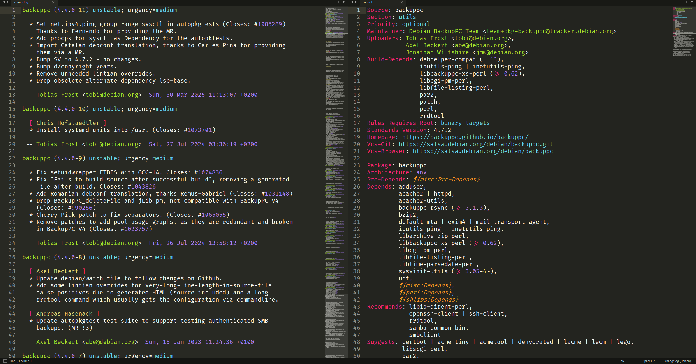

# sublime-debian

Debian packaging file syntax highlighting for Sublime Text.

## Features

Provides syntax highlighting for the following Debian packaging files:

#### Source package metadata
 - `debian/control`, `debian/copyright`, `debian/changelog`, `debian/NEWS`
 - `debian/upstream/metadata`, `debian/tests/control` (autopkgtest)

#### Source format & build options
 - `debian/source/format`, `debian/source/options`, `debian/source/local-options`
 - `debian/compat`, `debian/watch`, `debian/patches/series`, `debian/gbp.conf`

#### Debhelper & packaging helpers
 - `debian/*.install`, `*.dirs`, `*.links`, `*.docs`, `*.clean`, `*.manpages`, `*.examples`, `*.not-installed`, `*.conffiles`, `*.info`
 - `debian/*.maintscript`, `*.triggers`, `*.symbols`, `*.templates`
 - `debian/*.doc-base`, `*.lintian-overrides`, `*.alternatives`, `*.shlibs`
 - `debian/substvars`

#### Generated files
 - `.dsc`, `.changes`, `.buildinfo`

#### APT sources
 - `/etc/apt/sources.list` (one-line format)
 - `/etc/apt/sources.list.d/*.sources` (deb822 format)

#### Editor integration
 - Field name completions for `control`, `copyright`, `watch`, and `sources` files
 - Snippets: `source` / `package` paragraphs (control), `entry` (changelog), `files` block (copyright)
 - Goto Symbol support for changelog versions, control fields, and gbp.conf sections

## Preview

Debian `changelog` and `control` files with Sublime Text's default `Monokai` color scheme:



All files used in these screenshots are part of the [backuppc](https://salsa.debian.org/debian/backuppc) Debian package.

## Installation

### With Package Control

1. [Install Package Control](https://packagecontrol.io/installation)
2. Install [Debian Syntax package](https://packagecontrol.io/packages/Debian%20Syntax)

    | Platform      | Install Command                                                   |
    | --------------| ----------------------------------------------------------------- |
    | macOS         | <kbd>Cmd</kbd> + <kbd>Shift</kbd> + <kbd>P</kbd> → Package Control: Install Package → Debian Syntax  |
    | Linux/Windows | <kbd>Ctrl</kbd> + <kbd>Shift</kbd> + <kbd>P</kbd> → Package Control: Install Package → Debian Syntax |

3. Reopen all Debian packaging files or restart Sublime Text

### Without Package Control

1. Locate your Sublime Text "Packages" directory and navigate to it

    | Platform | Installation Path                                           |
    | -------- | ----------------------------------------------------------- |
    | Linux    | `~/.config/sublime-text/Packages/`                          |
    | macOS    | `~/Library/Application\ Support/Sublime\ Text/Packages/`    |
    | Windows  | `%AppData%\Roaming\Sublime Text\Packages`                   |

2. Clone this repository into `Debian Syntax` directory

    ```bash
    git clone https://github.com/barnumbirr/sublime-debian.git 'Debian Syntax'
    ```

## Credit

A heartfelt thank you goes out to the following people for making `sublime-debian` a reality:

 - [braver](https://github.com/braver)
 - [deathaxe](https://github.com/deathaxe)
 - [michaelblyons](https://github.com/michaelblyons)
 - [OdatNurd](https://github.com/OdatNurd)

## License:

```
Copyright 2020-2026 Martin Simon

Licensed under the Apache License, Version 2.0 (the "License");
you may not use this file except in compliance with the License.
You may obtain a copy of the License at

   http://www.apache.org/licenses/LICENSE-2.0

Unless required by applicable law or agreed to in writing, software
distributed under the License is distributed on an "AS IS" BASIS,
WITHOUT WARRANTIES OR CONDITIONS OF ANY KIND, either express or implied.
See the License for the specific language governing permissions and
limitations under the License.
```

## Buy me a coffee?

If you feel like buying me a coffee (or a beer?), donations are welcome:

```
BTC : bc1qq04jnuqqavpccfptmddqjkg7cuspy3new4sxq9
DOGE: DRBkryyau5CMxpBzVmrBAjK6dVdMZSBsuS
ETH : 0x2238A11856428b72E80D70Be8666729497059d95
LTC : MQwXsBrArLRHQzwQZAjJPNrxGS1uNDDKX6
```
